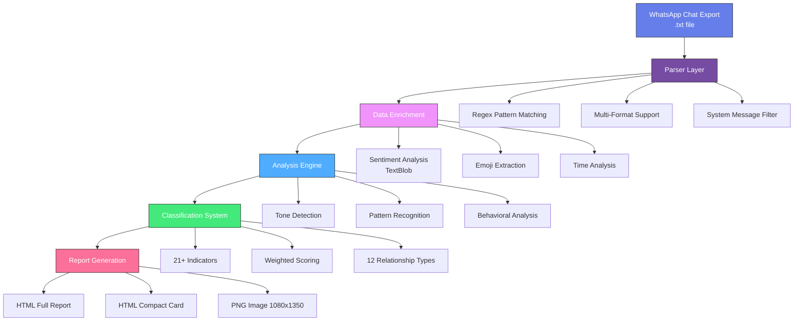
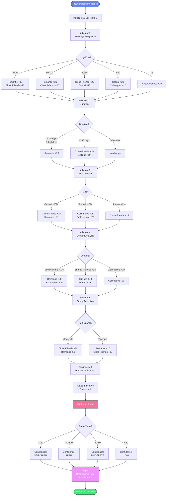
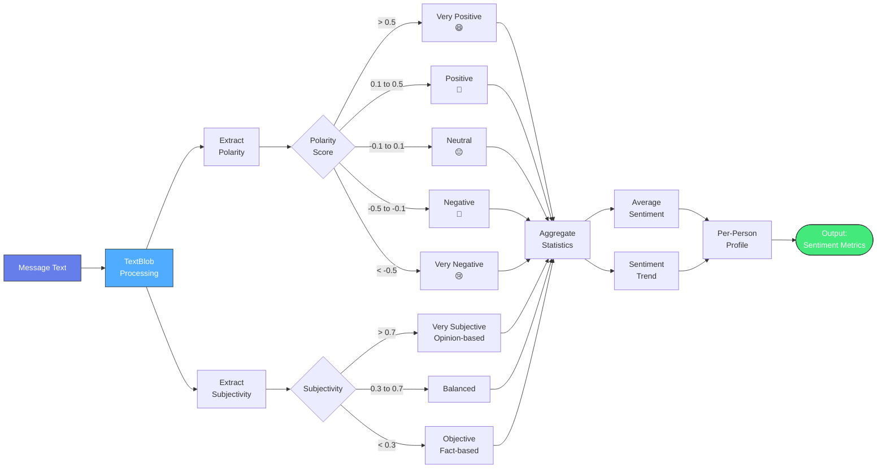
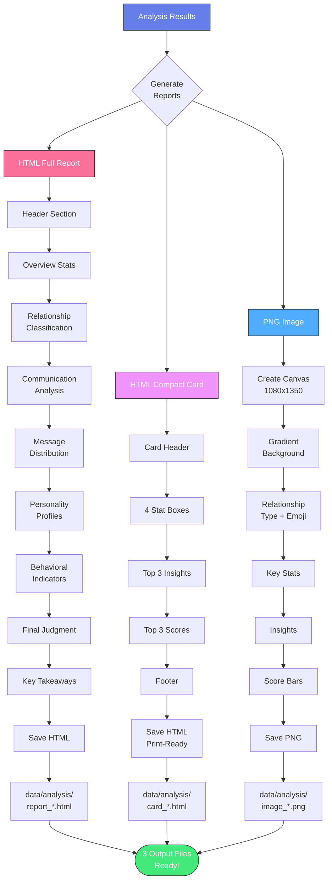
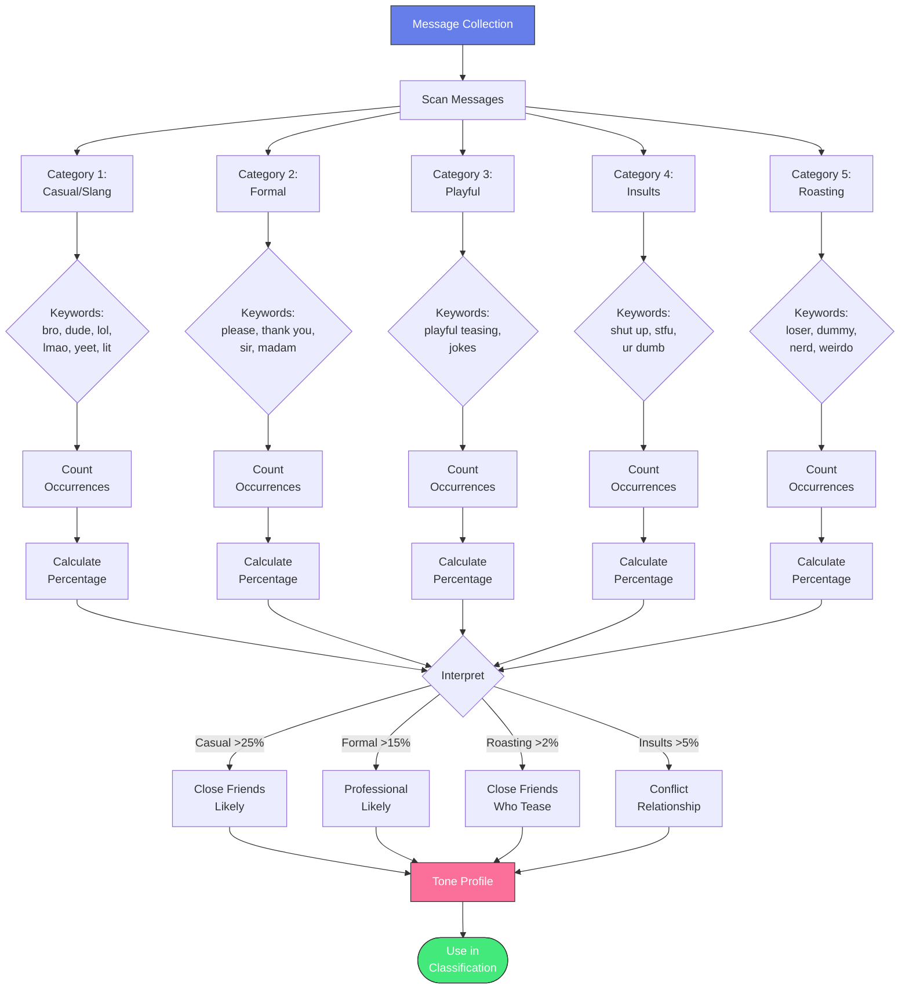
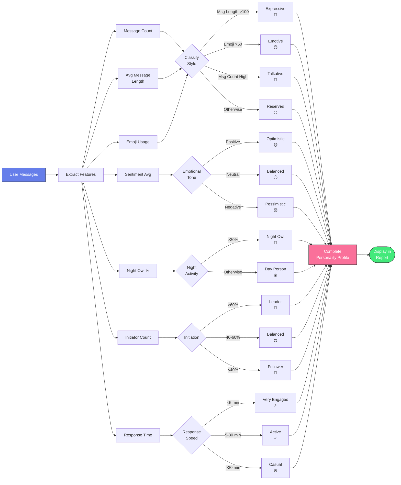
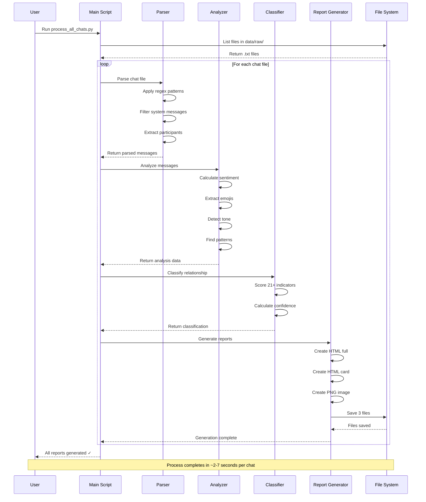

# 📊 System Architecture & Flow Diagrams

This document contains interactive flowcharts and diagrams explaining the WhatsApp Friendship Analyzer architecture.

## 🏗️ High-Level Architecture



## 🔄 Data Processing Flow

```mermaid
flowchart TD
    Start([Start: Chat Export]) --> Read[Read File Line by Line]
    Read --> TryParse{Try Regex<br/>Patterns}
    
    TryParse -->|Pattern 1| P1[Bracketed AM/PM<br/>[MM/DD/YY HH:MM:SS AM]]
    TryParse -->|Pattern 2| P2[US Format<br/>MM/DD/YY HH:MM - ]
    TryParse -->|Pattern 3| P3[EU Format<br/>DD/MM/YY HH:MM - ]
    TryParse -->|Pattern 4| P4[Bracketed<br/>[DD/MM/YY HH:MM:SS]]
    
    P1 --> Parse[Extract Components]
    P2 --> Parse
    P3 --> Parse
    P4 --> Parse
    TryParse -->|No Match| Append[Append to<br/>Previous Message]
    
    Parse --> System{System<br/>Message?}
    System -->|Yes| FilterSys[Mark as System<br/>Sender = 'System']
    System -->|No| FilterUser[User Message]
    
    FilterSys --> Store[Store Message]
    FilterUser --> Store
    Append --> Store
    
    Store --> More{More<br/>Lines?}
    More -->|Yes| Read
    More -->|No| Enrich[Enrich Messages]
    
    Enrich --> Sentiment[Add Sentiment Scores]
    Sentiment --> Emoji[Extract Emojis]
    Emoji --> Time[Calculate Response Times]
    Time --> TOD[Mark Time of Day]
    TOD --> Analyze[Analyze Patterns]
    
    Analyze --> Classify[Classify Relationship]
    Classify --> Generate[Generate Reports]
    Generate --> End([End: 3 Output Files])
    
    style Start fill:#667eea,stroke:#333,color:#fff
    style End fill:#43e97b,stroke:#333,color:#fff
    style Parse fill:#4facfe,stroke:#333,color:#fff
    style Classify fill:#fa709a,stroke:#333,color:#fff
```

## 🎯 Relationship Classification Algorithm



## 🧠 Sentiment Analysis Pipeline



## 📈 Report Generation Process



## 🔍 Tone Detection System



## 🎭 Personality Profiling



## 🔢 Scoring Matrix Visualization

```mermaid
graph TD
    subgraph "Message Frequency Scoring"
        A1[">100 msgs/day"] --> B1[Romantic Dating +30]
        A1 --> B2[Close Friends +20]
        A2["50-100 msgs/day"] --> B3[Romantic Dating +20]
        A2 --> B4[Close Friends +25]
        A3["20-50 msgs/day"] --> B5[Close Friends +20]
        A3 --> B6[Casual Friends +15]
        A4["5-20 msgs/day"] --> B7[Casual Friends +20]
        A4 --> B8[Colleagues +15]
        A5["<5 msgs/day"] --> B9[Acquaintances +20]
    end
    
    subgraph "Tone Modifiers"
        C1["Casual >25%"] --> D1[Close Friends +25]
        C1 --> D2[Romantic -10]
        C2["Formal >15%"] --> D3[Colleagues +25]
        C2 --> D4[Professional +20]
        C3["Roasting >2%"] --> D5[Close Friends +20]
        C3 --> D6[Romantic -15]
    end
    
    subgraph "Content Boosters"
        E1["Life Planning >1%"] --> F1[Romantic Dating +30]
        E1 --> F2[Romantic Established +25]
        E2["Shared Parents >2%"] --> F3[Siblings +40]
        E2 --> F4[Romantic -30]
        E3["Work Terms >20"] --> F5[Colleagues +20]
        E3 --> F6[Professional +15]
    end
    
    subgraph "Group Override"
        G1["Participants >2"] --> H1[Close Friends +30]
        G1 --> H2[Romantic -50]
        G1 --> H3[Romantic Established -50]
    end
    
    B1 --> Final
    B2 --> Final
    B3 --> Final
    B4 --> Final
    B5 --> Final
    B6 --> Final
    B7 --> Final
    B8 --> Final
    B9 --> Final
    D1 --> Final
    D2 --> Final
    D3 --> Final
    D4 --> Final
    D5 --> Final
    D6 --> Final
    F1 --> Final
    F2 --> Final
    F3 --> Final
    F4 --> Final
    F5 --> Final
    F6 --> Final
    H1 --> Final
    H2 --> Final
    H3 --> Final
    
    Final[Sum All Scores]
    Final --> Result[Select Max Score<br/>= Relationship Type]
    
    style A1 fill:#667eea,stroke:#333,color:#fff
    style Final fill:#fa709a,stroke:#333,color:#fff
    style Result fill:#43e97b,stroke:#333,color:#fff
```



## 🌐 System Component Interaction



---

## 📱 Mobile-Friendly Views

All diagrams above are interactive and responsive. Click/tap on any node for more details (in supported viewers like GitHub, GitLab, or Mermaid Live Editor).

## 🎨 Color Legend

- 🟣 **Purple (#667eea)**: Input/Start points
- 🟢 **Green (#43e97b)**: Output/End points  
- 🔴 **Pink (#fa709a)**: Critical decision points
- 🔵 **Blue (#4facfe)**: Processing steps
- 🟡 **Pink-Purple (#f093fb)**: Data transformations

---

**View these diagrams interactively on GitHub Pages!**
